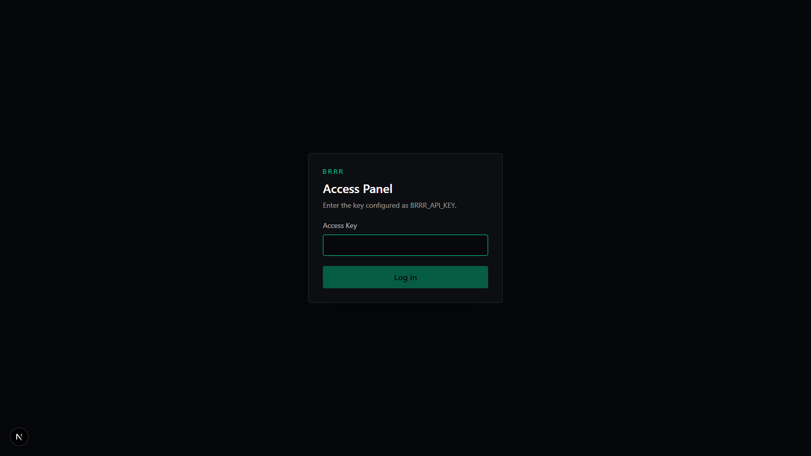
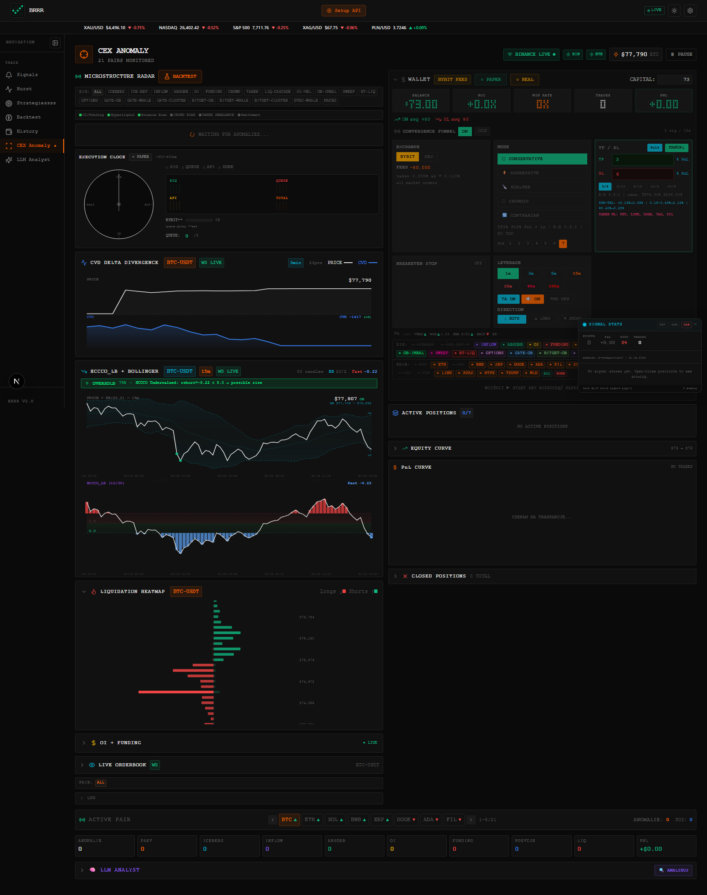
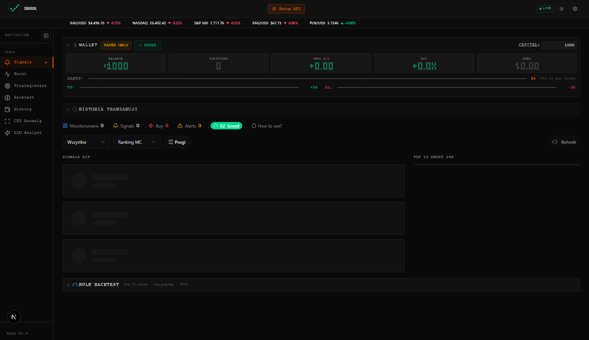
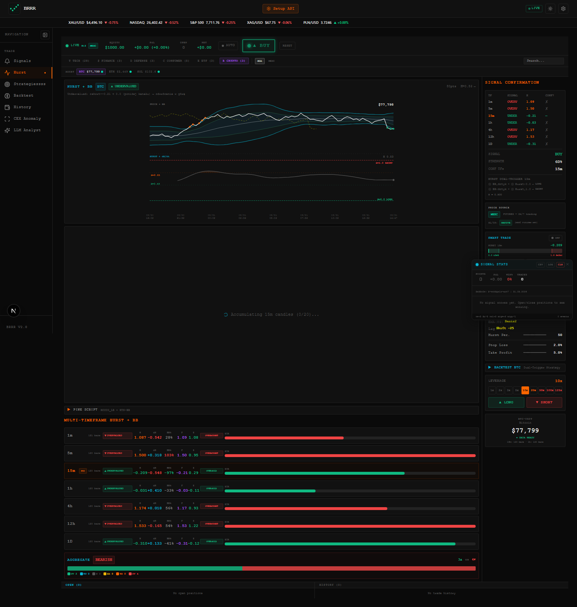
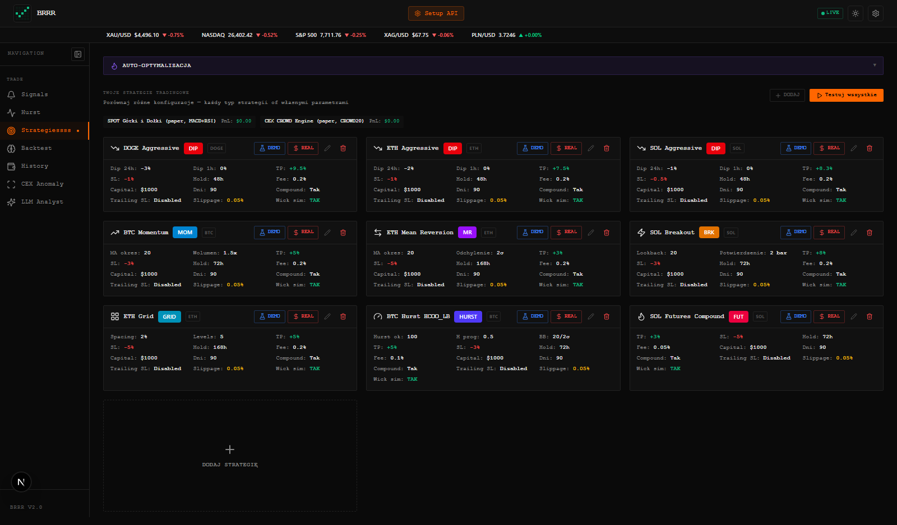
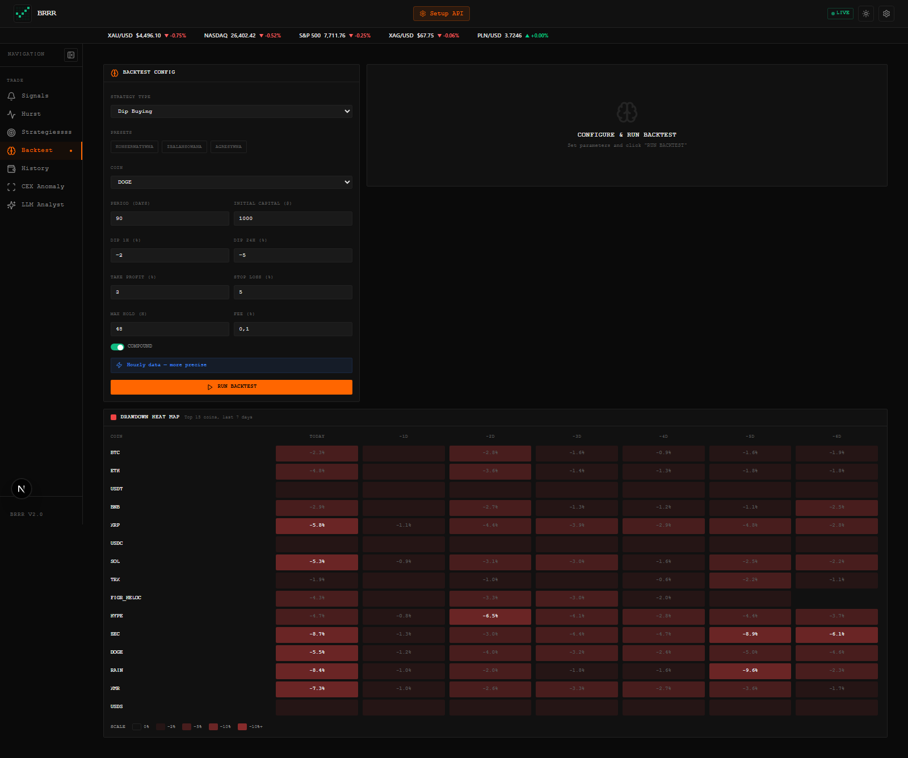
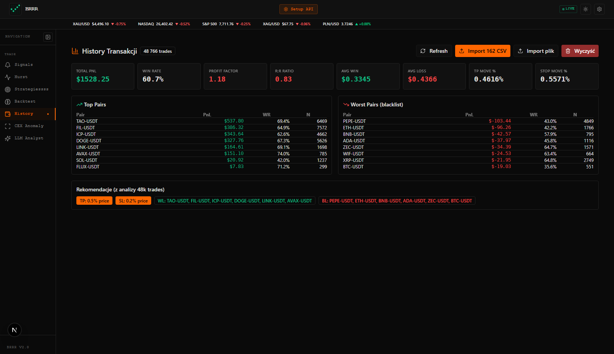
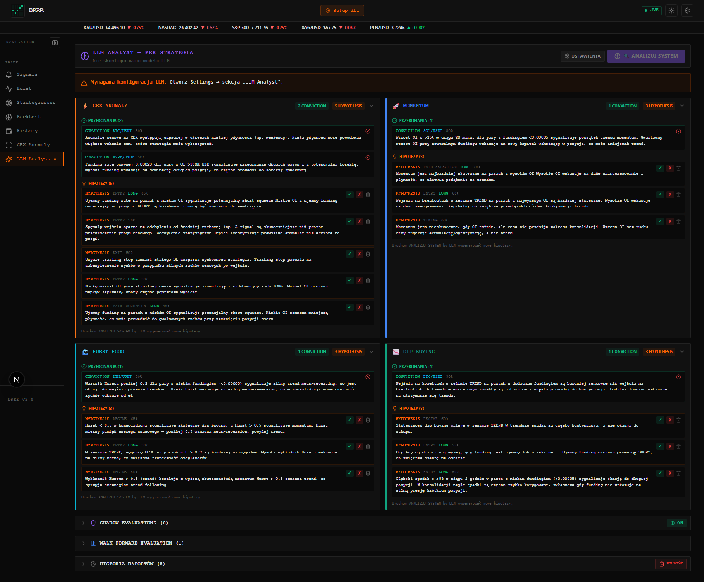

# BRRR — Trading Platform (Next.js)

> Trading terminal — Dip Hunter · CEX Anomaly · Hurst · LLM Analyst. Built for portfolio — production-ready, secure, multi-exchange (Bybit / Binance / MEXC / Hyperliquid).

   

**Live:** `http://localhost:3005` · **Auth:** `BRRR_API_KEY` (header `x-api-key` / `Authorization: Bearer` / cookie) · **DB:** SQLite + Prisma

---

## Screenshots

| Login | CEX Anomaly (default) | Sygnały |
|:---:|:---:|:---:|
|  |  |  |

| Hurst | Strategie | Backtest |
|:---:|:---:|:---:|
|  |  |  |

| Historia | LLM Analyst |
|:---:|:---:|
|  |  |

> Screenshots generated via Playwright (`screenshots/*.png`) on `localhost:3005`.

---

## Stack

- **Frontend:** Next.js 16 (App Router + Turbopack), React 19, Tailwind 4, shadcn/ui, Radix, Recharts, Framer Motion, TanStack Query/Table
- **Backend:** Next.js API Routes (59 routes), Prisma 5 + SQLite, AES-256-GCM encryption for exchange keys, Zod validation
- **Infra:** `output: standalone`, PM2 `ecosystem.config.js`, Caddy reverse proxy, `instrumentation.ts` schedulers (recovery / PnL sync / crowd engines)
- **Testing:** Vitest + jsdom

## Features (tabs)

| Tab | What it does |
|---|---|
| **Sygnały** (`/api/signals`) | Dip-buying classification, indicators (EMA/MA/StdDev/Hurst), market regime |
| **Hurst** (`hurst-backtest`) | BTC Hurst dual-trigger backtest (60s maxDuration) |
| **Strategie** (`/api/strategies/*`) | Universal framework (`dip_buying`, `momentum`, `mean_reversion`, `breakout`, `grid`, `hurst_hcoo_lb`, `futures_compound`) — activate/deactivate, live `strategy-runner` |
| **Backtest** (`/api/backtest/*`) | Single / bulk (1-15 coins) / optimize (grid search) — `backtest-engine` |
| **Historia** (`/api/trades/*`) | `TradeLog` / `ImportedTrade` (CSV), analytics, PnL |
| **CEX Anomaly** (`/api/cex-anomaly/*`, `ccxt`, `hyperliquid`) | Order-book walls, CVD, funding extremes, liquidation heatmap — main trading view |
| **LLM Analyst** (`/api/llm-*`, `ai-assistant`) | Multi-provider (OpenAI/Groq/OpenRouter/Gemini/Mistral/Ollama) + shadow evaluation / walk-forward |

**Other:** Bybit Futures (`/bybit/futures/*`), Binance / MEXC / Hyperliquid market data, Whale Alert, Fear & Greed, market-ticker (Yahoo).

## Quick start

```bash
# 1. env
cp .env.example .env
# fill: BRRR_API_KEY, CRON_SECRET, ENCRYPTION_KEY
# optional: REDIS_URL, RATE_LIMIT_DIR

# 2. install + prisma
npm install
npm run db:generate
npm run db:push

# 3. dev (port 3005 hardcoded in src/lib/server-config.ts)
npm run dev
# -> http://localhost:3005/login  (API: x-api-key header)

# 4. prod
npm run build
npm start
# or PM2: pm2 start ecosystem.config.js
```

## Env

```ini
DATABASE_URL=file:./db/custom.db
PORT=3005
BASE_URL=http://localhost:3005
BRRR_API_KEY= # required in production (proxy.ts)
CRON_SECRET=  # required — cron routes 503 until set (no hardcoded fallback)
ENCRYPTION_KEY= # required — AES-256-GCM for ExchangeApi (fail-closed in prod)
# REDIS_URL=redis://...
# RATE_LIMIT_DIR=./data/rate-limits
```

`.env` is gitignored (`#34` in `.gitignore`), `db/` + `prisma/db/` + `*.db` ignored.

## Security (audited)

- Auth on **all** `/api/*` via `src/proxy.ts` (cookie `AUTH_COOKIE_NAME` + `BRRR_API_KEY`)
- Rate limit `src/lib/rate-limit.ts` (in-memory / file / Redis) — `checkRateLimitAsync`, per-route `RATE_LIMITS`
- No hardcoded `CRON_SECRET` / `ENCRYPTION_KEY` fallbacks, cron 503 when unset
- Caddy security headers, no SSRF
- `prisma/schema.prisma` — exchange keys encrypted (`ExchangeApi.apiKey/apiSecret`)

## Repo layout

```
src/app/api/*        # 59 API routes
src/app/page.tsx     # tab shell (signals, hurst, strategies, backtest, history, cexanomaly, llm)
src/components/tabs/ # per-tab UI
src/lib/*            # strategy-runner, backtest-engine, cex-anomaly-*, llm-*, bybit.ts, binance.ts
prisma/schema.prisma # SQLite models
screenshots/         # Playwright captures for README
```

## Screenshots — how to regenerate

```bash
npx playwright install chromium
node brrr-screenshots.mjs  # uses http://localhost:3005 + BRRR_API_KEY
```

## License

Private — portfolio demo. Exchange keys are encrypted and never committed.

---

*Built with Next.js 16 · v0.2.0*
